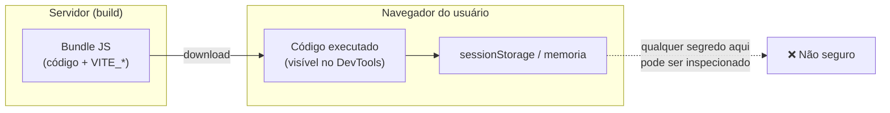
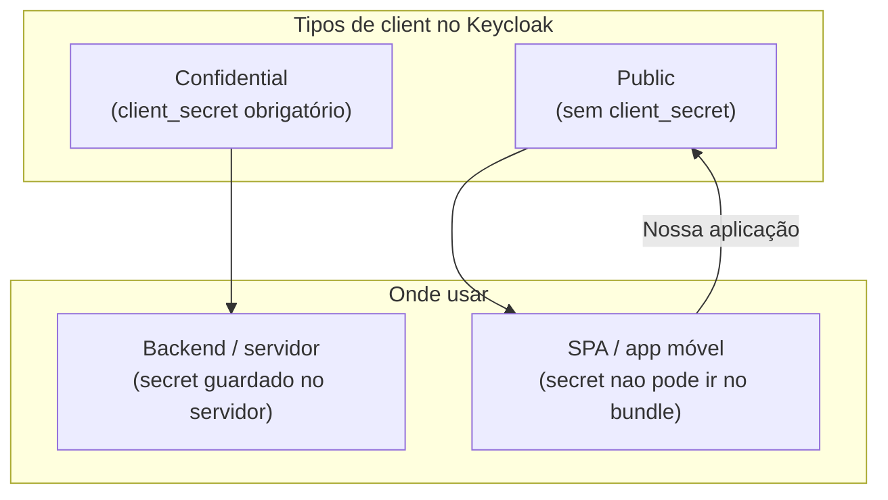
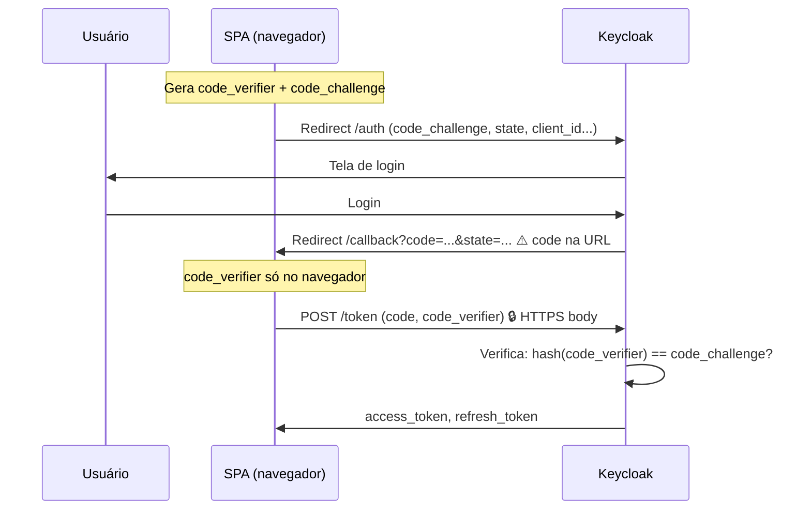
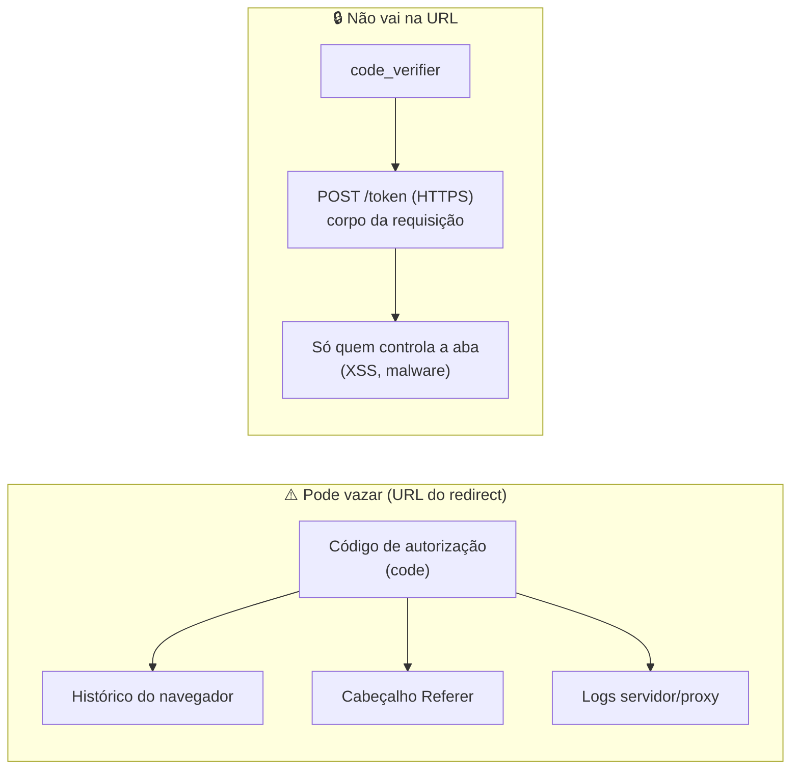
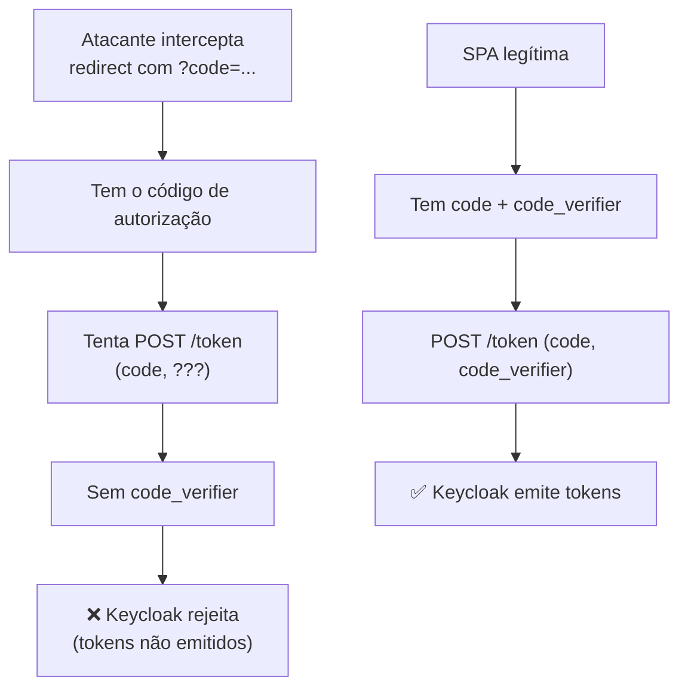

# Por que o client Keycloak precisa ser PUBLIC (e não usar client_secret)

Documento de justificativa técnica e de segurança para configuração do client no Keycloak como **public**, sem uso de **client_secret**, quando o consumidor é uma **SPA (Single Page Application)**.

---

## 1. Onde o código da aplicação roda

Nesta aplicação (frontend React/Vite):

- Todo o código JavaScript é **enviado ao navegador** e **executado no dispositivo do usuário**.
- Qualquer pessoa pode abrir as ferramentas do desenvolvedor (DevTools), ver o código-fonte e inspecionar variáveis, rede e armazenamento (localStorage, sessionStorage).
- **Não existe ambiente “seguro” no frontend** para guardar segredos. Tudo que estiver no bundle (código ou variáveis de ambiente como `VITE_*`) pode ser extraído.

Por isso, **não é seguro** colocar um **client_secret** em uma SPA: ele seria exposto e deixaria de ser segredo.

---

## 2. Por que não usar client_secret no frontend

| Aspecto                                | Explicação                                                                                                                                                                            |
| -------------------------------------- | ------------------------------------------------------------------------------------------------------------------------------------------------------------------------------------- |
| **Onde o secret ficaria**              | No código ou em variáveis de ambiente (`VITE_*`), que são embutidas no build e enviadas ao navegador.                                                                                 |
| **Quem pode ver**                      | Qualquer usuário que abrir o DevTools ou inspecionar o bundle.                                                                                                                        |
| **Consequência**                       | Quem obtiver o client_secret poderia se passar pelo client e trocar códigos de autorização por tokens, comprometendo a segurança do client no Keycloak.                               |
| **Recomendação OAuth 2.0 / OAuth 2.1** | Clients que não podem guardar segredos de forma confiável (como SPAs) **não devem usar client_secret**. O padrão e as boas práticas (BCP) indicam uso de **PKCE** para esses clients. |

Conclusão: **em uma SPA, client_secret não deve ser usado.** O client no Keycloak precisa ser configurado de forma que **não exija** client_secret (ou seja, como **public**).

---

## 3. Por que o client deve ser PUBLIC

No Keycloak (e no OAuth 2.0 em geral), há dois tipos de client em relação ao segredo:

- **Confidential**
  - Pensado para aplicações que rodam em ambiente controlado (ex.: backend).
  - **Exige** client_id + client_secret na troca de código por token.
  - O secret pode ser guardado com segurança no servidor.

- **Public**
  - Pensado para aplicações que rodam no navegador ou em dispositivos do usuário (SPAs, apps móveis nativos).
  - **Não usa** client_secret.
  - A segurança da troca de código por token é garantida por **PKCE** (Proof Key for Code Exchange).

Como a nossa aplicação é uma **SPA**, ela se enquadra no segundo caso. Por isso:

- O client no Keycloak **deve** ser configurado como **public** (Keycloak 17+: **Client authentication** = OFF).
- Assim o Keycloak **não exige** client_secret no token endpoint e aceita o fluxo **Authorization Code + PKCE**.

Se o client estiver como **confidential**, o Keycloak sempre vai exigir `client_secret` na requisição de token e retornar erro do tipo \*“Client secret not provided in request”\_ quando a SPA (corretamente) não enviar esse valor.

---

## 4. Segurança: PKCE no lugar do client_secret

Com client **public**, a segurança da troca do código de autorização por tokens não depende do client_secret, e sim do **PKCE**:

1. **Antes** de redirecionar o usuário para o Keycloak, a SPA gera:
   - um **code_verifier** (valor aleatório), e
   - um **code_challenge** (derivado do code_verifier, ex.: SHA-256 em Base64url).

2. Na etapa de **autorização**, a SPA envia ao Keycloak apenas o **code_challenge** (e o método, ex.: S256). O **code_verifier** fica apenas no navegador (em memória/sessionStorage).

3. O Keycloak associa o código de autorização ao **code_challenge** que recebeu.

4. Na etapa de **token**, a SPA envia:
   - o **código** recebido no redirect, e
   - o **code_verifier** correspondente.

5. O Keycloak recalcula o challenge a partir do code_verifier e **só emite tokens** se bater com o challenge que foi enviado na autorização.

Efeitos de segurança:

- Mesmo que alguém **intercepte o código de autorização** (ex.: em um redirect), **não consegue** trocá-lo por tokens sem o **code_verifier**, que nunca foi enviado ao Keycloak na primeira etapa e só existe no contexto daquela sessão da SPA.
- O **client_secret** não entra em cena e **não precisa** existir para esse client.

Ou seja: **a segurança é garantida pelo PKCE; o client_secret não é necessário e não deve ser usado em SPA.**

---

## 4.1. “Se o JavaScript fica no navegador, como o PKCE é seguro?”

É natural perguntar: se o código roda no navegador e o **code_verifier** também fica lá (em memória ou sessionStorage), não seria fácil para um atacante pegá-lo?

A diferença está em **onde cada dado trafega** e **quem consegue vê-lo sem executar código na sua aba**:

| Dado                      | Onde trafega                                                                                                          | Quem pode ver sem estar na sua sessão                                                                                                                                                      |
| ------------------------- | --------------------------------------------------------------------------------------------------------------------- | ------------------------------------------------------------------------------------------------------------------------------------------------------------------------------------------ |
| **Código de autorização** | Na **URL do redirect** (quando o Keycloak devolve o usuário para a sua aplicação).                                    | Qualquer um que tiver acesso à URL: histórico do navegador, cabeçalho Referer, logs de servidor/proxy, ou um atacante que intercepte o redirect. O código **vaza** pelo canal do redirect. |
| **code_verifier**         | Só no **corpo de um POST** direto do navegador para o endpoint de token (HTTPS). **Nunca** vai na URL de um redirect. | Quem já tiver **controle total** da sua aba (ex.: script malicioso na página, malware no dispositivo). Não aparece em URL, Referer ou logs de redirect.                                    |

**O que o PKCE protege**

- O ataque que o PKCE endereça é a **interceptação do código de autorização**: alguém obtém o **code** (pela URL do redirect, logs, Referer etc.) e tenta trocá-lo por tokens no servidor de token.
- Sem PKCE (e sem client_secret): quem tiver o código poderia trocá-lo por tokens, pois o token endpoint não teria como saber se a requisição veio do navegador legítimo.
- Com PKCE: o token endpoint **só aceita** o código se vier junto do **code_verifier** que gera o **code_challenge** que foi enviado na autorização. O code_verifier **não aparece na URL do redirect**; só é enviado no POST de token. Quem só interceptou o redirect (e ficou com o código) **não tem** o code_verifier e **não consegue** obter os tokens.

**O que o PKCE não protege**

- Se um atacante **já executa código no seu navegador** (XSS, extensão maliciosa, malware), ele pode ler sessionStorage/memória e obter o code_verifier ou os próprios tokens. PKCE não resolve isso; a defesa é evitar XSS, CSP, etc.
- Ou seja: PKCE **não torna o frontend “inviolável”**; ele **fecha um vazamento específico** — o código de autorização que trafega na URL e pode ser roubado por quem não controla a sua aba.

**Por que isso é melhor que client_secret no frontend**

- **client_secret** no frontend ficaria no **código-fonte ou no bundle** — **igual para todos os usuários** e **permanente**. Qualquer pessoa que abrisse o app uma vez poderia extrair o secret e **sempre** se passar pelo client.
- O **code_verifier** é **único por fluxo de login**, **temporário** e **nunca vai na URL**. Quem só conseguir o código de autorização (o que vaza no redirect) continua sem conseguir trocá-lo por tokens.

Resumindo: o JavaScript no navegador gera e guarda o code_verifier, mas ele **não é enviado no redirect**; só no POST de token. Quem intercepta só o redirect (onde o código de autorização vaza) não tem o code_verifier, e por isso o PKCE continua seguro para esse tipo de ataque.

---

## 5. Resumo para o administrador do Keycloak

- **Client para esta SPA deve ser PUBLIC:**
  - **Keycloak 17+:** em **Clients** → [client] → **Settings** → **Client authentication** = **OFF**.
  - **Keycloak 16 e anteriores:** **Access type** = **public**.

- **Não usar client_secret para este client** no fluxo usado pela SPA. O fluxo correto é **Authorization Code + PKCE**, sem envio de client_secret.

- **Segurança:** O padrão OAuth 2.0/2.1 e as boas práticas para “browser-based apps” recomendam exatamente esse modelo (client public + PKCE) para aplicações que rodam no navegador, onde não há como armazenar um segredo com segurança.

---

## 6. Referências

- [OAuth 2.0 for Browser-Based Apps (BCP)](https://datatracker.ietf.org/doc/html/draft-ietf-oauth-browser-based-apps) — recomenda PKCE e desaconselha client_secret em aplicações no browser.
- [PKCE — RFC 7636](https://datatracker.ietf.org/doc/html/rfc7636)
- [Keycloak — Securing Applications](https://www.keycloak.org/docs/latest/securing_apps/) — documentação sobre clients public e JavaScript adapter.
- [Keycloak — Credentials support removed from JavaScript adapter](https://www.keycloak.org/docs/latest/release_notes/#credentials-support-removed-from-the-javascript-adapter) — motivação para não usar credentials no adapter JS.
